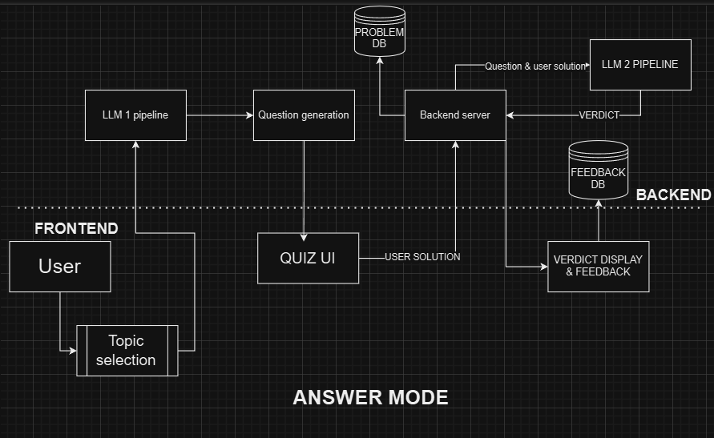
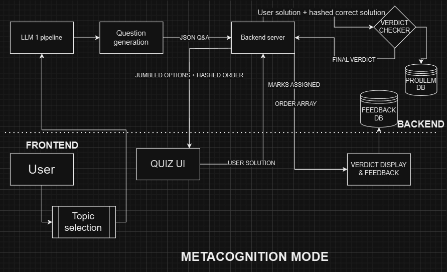
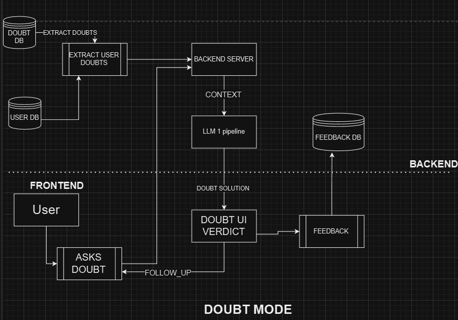
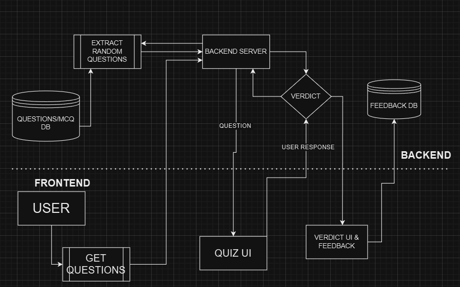

# Knolly: Revolutionizing AI Tutoring

Welcome to **Knolly**, an AI-powered tutoring platform designed to provide personalized learning experiences for students. This repository showcases the working demo and visual insights into Knolly's core features.

## Features Overview

1. **Answer Mode:** Instant, step-by-step solutions to math queries.
2. **Metacognition Mode:** Detailed explanations to foster conceptual clarity.
3. **DoubtBot:** A 24/7 interactive AI chatbot for real-time query resolution.
4. **Conventional vs. AI Design:** Comparison of traditional tutoring methods with Knolly's AI-driven innovation.

## Visuals

### 1. Answer Mode

*Illustrates how Knolly provides quick and accurate answers to complex math problems.*

### 2. Metacognition Mode

*Focuses on breaking problems into understandable concepts for deeper learning.*

### 3. DoubtBot

*Interactive chatbot for instant and personalized query resolution.*

### 4. Conventional vs AI Design

*Highlights the advantages of Knolly's AI-driven tutoring over conventional methods.*

## Demo Video

### Watch the Demo

*Explore Knolly in action, showcasing its features and benefits in real-world scenarios.*

